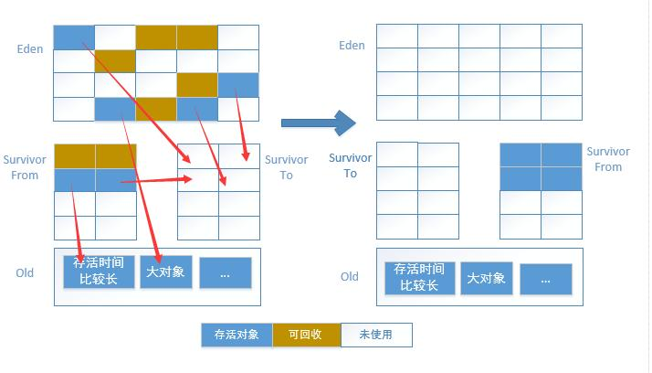

# JVM

## 什么是虚拟机

java虚拟机是执行java字节码的进程。

java源文件====编译=====》.class字节码文件=======运行=========>在java虚拟机中

java语言一次编译，到处运行（跨平台）。跨平台的是java程序（包括字节码文件），jvm是不跨平台的，不同的平台需要安装不同版本的JVM


## JVM由哪几个部分构成


## 运行时数据区


线程共享区： 方法去， 堆

线程不共享： 虚拟机栈，本地方法栈，程序计数器

- 程序计数器： 可以理解为当前线程执行的代码行号

- 虚拟机栈： 描述的是java方法执行时的内存模型

  ```
  每次方法执行时，都会创建一个栈帧，用来存储局部变量，方法出口，形参列表等
  每个方法调用都意味着一个栈帧从入栈到出栈的过程
  ```

- 本地方法栈： 功能与虚拟机栈相同。 只是本地方法栈是为本地native方法实现的

- 堆内存： 线程共享。垃圾收集主要管理的区域， 我们new的对象都存在这里

- 方法区:  线程共享。 主要存储类信息，常亮，静态变量等数据


## 堆和栈的区别

栈内存用来存储基本类型的变量和对象的引用变量。存储的是指向堆内存的内存地址。

堆内存用来存储Java中的对象，无论是成员变量，局部变量，还是类变量。存储的是实际的数据

## java对象创建的过程

1. 当虚拟机遇到new关键词时， 首先检查是否已经被加载过，没有加载的话加载进内存
2. 为对象分配内存
3. 为分配的对象进行初始化值处理（基本数据类型默认值，引用数据类型默认值null）
4. 为对象进行其他配置。比如对象的hashcode， GC分代年龄
5. 执行init方法。 为属性赋值，前边只是赋值为了初始值


## 对象是如何访问的

1. 句柄访问(栈内存的引用执行java堆中的一块句柄池， 句柄池指向了真实的数据)

   优点: 当真实对象发生了移动时， 栈内存的引用不需要发生改变（垃圾收集时移动对象是非常普遍的行为）

   

   

   2. 直接访问（占内存的引用直接引用了堆中的真实数据地址）

      优点： 速度更快， 因为它节省了一次指针定位的耗时


## 内存泄漏

除了程序计数器， 其他的运行时数据区都可能出现内存泄漏

## Java 中会存在内存泄漏吗？

理论上 Java 因为有垃圾回收机制（GC）不会存在内存泄露问题（这也是 Java 被广泛使用于服务器端编程的一个重要原因）。然而在实际开发中，可能会存在无用但可达的对象，这些对象不能被 GC 回收也会发生内存泄露。

## 什么是垃圾回收机制

- java中采用new或者反射创建的对象，都存在堆内存中。所有的对象回收都是由JVM通过垃圾回收机制（其实就是一个守护线程）完成的。它会时时监听着对象的状态
- java程序员不需要关心内存管理，因为垃圾收集器会自己处理
- 可以调用下面的方法之一：`System#gc()` 或 `Runtime#getRuntime()#gc()` 。 但是不一定会执行

## 如何判断一个对象是否死去

- 引用计数法

  ```
  每个对象都有1个引用属性。新增1个引用时加1.释放1个引用时减1，计数器为0时代表没有引用可以回收
  简单粗暴，但是无法解决循环引用的问题。 A引用B，B引用A
  ```

- 可达性分析**（java采用的就是）**

  从GC ROOTS(根)开始向下搜索，搜索所有走过的路称为引用链。当一个对象到GC ROOTS不存在引用链时即不可达。证明此对象是不可用的。

## 垃圾回收算法

- 标记-清除算法

  ```
  分为两个阶段: 标记（通过可达性分析）和清除
  
  缺点： 1. 性能不高
        2. 会产生大量的碎片
  ```

  

- 标记-整理算法

```
分为三个阶段： 标记和整理和清除

缺点：性能不高
优点：不会产生内存碎片
```


- 复制算法

  ```
  将内存分为大小相等的两块。 每次只使用其中一块， 当内存不足时，会将存活的对象全部移动到另外一块内存，这块内存全部清除
  
  优点：性能高，没有内存碎片
  缺点：浪费一半空间
  ```

  

  

  

- 分代收集算法

  ```
  目前虚拟机大都采用分代回收算法。 将java堆内存分为新生代和老年代，不同的代采用不同的回收算法。
  
  新生代：每次垃圾回收都会有大量的对象死亡，所以采用复制算法
  老年代：因为对象存活率高，采用标记整理或者标记清除算法
  ```

  

