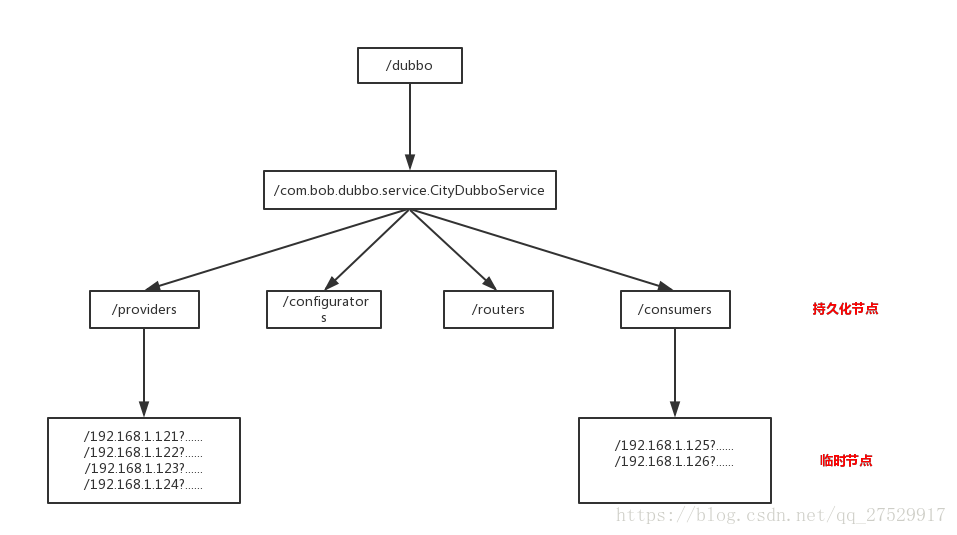

# 消息队列（MQ  message queue）

## 什么是消息队列

消息队列是异步消息中间件。 生产者负责将消息推送到中间件，中间件负责存储数据， 消息者从中间件获取数据


目前主流的消息队列有

- Kafka   scala
- RabbitMQ    elang
- RocketMQ ，老版本是 MetaQ 。   java
- ActiveMQ ，目前用的人越来越少了。  java

## 消息队列分为哪些角色

- 生产者（Producer）： 负责生产消息
- 消费者（Consumer）: 负责消费消息
- 消息代理（message broker）: 负责存储消息和转发消息， 转发分为两种方式
  - 拉取（pull）：是指consumer主动到broker进行消息的获取
  - 推送（push）：是broker主动将consumer订阅的消息推送给consumer

## 消息队列的应用场景

- 解耦

  ```
  比如说用户注册， 需要通知BC系统发短信，发邮件。。  A->B  A->C，忽然D系统也需要接入，A->D,A系统需要改代码。 
  
  A系统只需要将消息发送到MQ， BCD监听， 如果加了新的系统，只需要监听消息就行，A不需要改动
  ```

- 异步

  ```
  提升性能。。 A->b a->c a->d   150ms    总共需要450ms
  A->MQ。。    50ms
  ```

- 削峰

  ```
  比如说系统1s能处理500个请求. 秒杀活动（1.库存数量有限 2.请求量猛增）
  10W请求同时打进来，可能会把系统打垮。  10W消息存到消息队列里。 1s从消息队列拉取1000条数据。 队列堆积消息。
  ```

  

## 消息队列的优缺点

### 优点

解耦， 异步，削峰

### 缺点

- 系统的可用性降低
  - 比如A服务调用B没问题， 忽然引入了中间件。 万一MQ挂了，A与B就无法交互。 所以一定要考虑MQ的高可用
- 系统复杂性提高
  - 消息怎么不重复
  - 消息怎么不丢失
  - 消息怎么保证顺序
- 一致性问题
  - 比如A将消息发送到MQ，BCD三个系统进程消费， 假设BC处理成功，D处理失败。此时各个应用数据库的状态就会不一致，其实分布式系统本身就会存在这种问题，所以可以引入分布式事务进行解决。

## 消费语义

- 最多被消费一次: 消息可能会丢失但是绝不重传
- 最少被消费一次：消息可以重传，但绝不丢失
- 消息仅被消费一次：每一条消息只被传递一次


## 如何保证消费者的消费消息的幂等性

**幂等性：就是用户对于同一操作发起的一次请求或者多次请求的结果是一致的，不会因为多次点击而产生了副作用**。举个最简单的例子，那就是支付，用户购买商品使用支付，支付扣款成功，但是返回结果的时候网络异常，此时钱已经扣了，用户再次点击按钮，此时会进行第二次扣款，返回结果成功，用户查询余额返发现多扣钱了，流水记录也变成了两条

**查询天然幂等操作，增删改非幂等操作**

如果要达到消费者的消费消息的幂等性，就需要**消息仅被消费一次**，且**每条消息从 Producer 保证被送达，并且被 Consumer 仅消费一次**。

### 什么场景用到了消息队列

支付完成之后需要通知订单系统，通知勾兑系统

# dubbo

## Dubbo 是什么

Dubbo 是一款高性能、轻量级的开源 RPC（remote processing c） 框架

## Dubbo 核心功能有哪些

- 远程调用,像调用本地方法一样调用远程服务
- 服务地址的自动注册与发现（zookeeper）
- 负载均衡，集群容错


- Provider：暴露服务的服务提供方
- Consumer：调用远程服务消费方
- Registry：服务注册与发现注册中心
- Monitor：监控中心和访问调用统计
- Container：服务运行容器

## Dubbo 服务器注册与发现的流程？

1. 服务容器Container负责启动，加载，运行服务提供者。
2. 服务提供者Provider在启动时，向注册中心注册自己提供的服务。
3. 服务消费者Consumer在启动时，向注册中心订阅自己所需的服务。
4. 注册中心Registry返回服务提供者地址列表给消费者，如果有变更，注册中心将基于长连接推送变更数据给消费者。
5. 服务消费者Consumer，从提供者地址列表中，基于软负载均衡算法，选一台提供者进行调用，如果调用失败，再选另一台调用。
6. 服务消费者Consumer和提供者Provider，在内存中累计调用次数和调用时间，定时每分钟发送一次统计数据到监控中心Monitor。


## Dubbo 有哪些注册中心

- Multicast 注册中心
- Zookeeper 注册中心
- Redis 注册中心
- Simple 注册中心

推荐使用 Zookeeper 作为注册中心

## Dubbo 的注册中心集群挂掉，发布者和订阅者之间还能通信么

可以通讯。启动 Dubbo 时，消费者会从 Zookeeper 拉取注册的生产者的地址接口等数据，缓存在本地。每次调用时，按照本地存储的地址进行调用。

## Dubbo集群提供了哪些负载均衡策略

- Random LoadBalance: 随机选取提供者策略，有利于动态调整提供者权重。截面碰撞率高，调用次数越多，分布越均匀。

- RoundRobin LoadBalance: 轮循选取提供者策略，平均分布，但是存在请求累积的问题。

- LeastActive LoadBalance: 最少活跃调用策略，解决慢提供者接收更少的请求。

- ConstantHash LoadBalance: 一致性 Hash 策略，使相同参数请求总是发到同一提供者，一台机器宕机，可以基于虚拟节点，分摊至其他提供者，避免引起提供者的剧烈变动。

## Dubbo的集群容错方案有哪些

- Failover Cluster：失败自动切换，当出现失败，重试其它服务器。通常用于读操作，但重试会带来更长延迟。
- Failfast Cluster：快速失败，只发起一次调用，失败立即报错。通常用于非幂等性的写操作，比如新增记录。
- Failsafe Cluster：失败安全，出现异常时，直接忽略。通常用于写入审计日志等操作。
- Failback Cluster：失败自动恢复，后台记录失败请求，定时重发。通常用于消息通知操作。
- Forking Cluster：并行调用多个服务器，只要一个成功即返回。通常用于实时性要求较高的读操作，但需要浪费更多服务资源。可通过 forks=”2″ 来设置最大并行数。
- Broadcast Cluster：广播调用所有提供者，逐个调用，任意一台报错则报错 。通常用于通知所有提供者更新缓存或日志等本地资源信息。

默认的容错方案是 Failover Cluster。

# zookeeper

## Zookeeper 是什么

zokeeper是一个分布式协调服务，它是集群的管理者

## zookeeper功能有哪些

数据发布/订阅、负载均衡、命名服务、分布式协调/通知、集群管理、Master 选举、分布式锁和分布式队列等功能。


- 基于 Dubbo 框架开发的提供者、消费者都向 Zookeeper 注册自己的 URL ，消费者还能拿到并订阅提供者的注册 URL ，以便在后续程序的执行中去调用提供者。
- 而提供者发生了变动，也会通过 Zookeeper 向订阅的消费者发送通知。

## zokeeper的数据结构


Zookeeper 提供一个多层级的节点命名空间(节点称为 znode)。

## zokeeper的几点类型

- PERSISTENT 持久节点（创建之后一直存在， 除非进行删除操作）
- EPHEMERAL 临时节点（当与zookeeper节点断开连接后自动删除）

## dubbo是如何注册zookeeper的

Dubbo在Zookeeper上注册的节点目录：假设接口名称是：com.bob.dubbo.service.CityDubboService



Dubbo启动时，Consumer和Provider都会把自身的URL格式化为字符串，然后注册到zookeeper相应节点下，作为一个临时节点，当连断开时，节点被删除。

Consumer在启动时，不仅仅会注册自身到 …/consumers/目录下，同时还会订阅…/providers目录，实时获取其上Provider的URL字符串信息。

## 集群中的角色

- Leader（接收请求）
- Follower （处理请求， 参与投票）
- observer（处理请求， 不参与投票）

在一个集群中，最少需要 3 台。或者保证 2N + 1 台，即奇数。为什么保证奇数？主要是为了选举算法。

## **集群如果有 3 台机器，挂掉 1 台集群还能工作吗？挂掉 2 台呢？**

记住一个原则：过半存活即可用。所以挂掉 1 台可以继续工作，挂掉 2 台不可以工作。

## 选主过程

比如当前集群中的leader节点挂掉，之后存在的只剩follower和observer节点。 此时follower参与投票，票数最高者为主

# springboot

## 什么是springboot

Spring Boot 是 Spring 开源组织下的子项目，主要是简化了使用 Spring 的难度，简省了繁重的配置，提供了各种启动器，使开发者能快速上手

## 为什么要用SpringBoot

- 内嵌web容器
- 快速开发
- 配置简单

## SpringBoot与SpringCloud 区别

SpringBoot是快速开发的Spring框架，SpringCloud是完整的微服务框架，SpringCloud依赖于SpringBoot。

## Spring Boot 的核心注解是哪个

@SpringBootApplication，继承了

- @SpringBootConfiguration， 继承了@Configuration ：标注是spring的一个配置类
- @EnableAutoConfiguration： 打开自动装配功能
- @ComponentScan：扫描包，默认当前类的同目录及子目录

## SpringBoot Starter的工作原理

```
SpringBoot就是由各种Starter组合起来的，我们自己也可以开发Starter
```

在sprinBoot启动时由@SpringBootApplication注解会自动去maven中读取每个starter中的spring.factories文件,该文件里配置了所有需要被创建spring容器中的bean，并且进行自动配置把bean注入spirngioc容器中

# 遇到的问题及解决方式

### dubbo无法调用最新的方法

dubbo服务提供者需要提供一个api jar包，供消费者引用。     比如我们对jar包进行了更新，但是未提交到私服， 则消费者无法从私服拉下来新的jar包，无法远程调用新的方法。

需要将新的jar包deploy(部署)到私服

### dubbo调用不到服务

当消费者远程调用下游服务无法调用时， 可能下游系统未注册到注册中心，需要到注册中心查询是否注册成功

### 金额精度问题

在开发过程中必须使用BigDecimal来操作金额。 不可使用Float，Double。 因为计算机计算数据是2进制。 double计算首先会将10进制转为2进制， 最终再2进制转为10进制。 但是有些金额时无法转换的，就会出现精度丢失

### 微信支付高并发

微信支付对每个商户支持的交易量有限制。 比如微信1秒钟支持请求100次， 而我们需要发起500笔交易。 此时可以利用延迟处理（削峰按照微信可以承受的频率发起交易），而我们采用的是在微信开辟多个商户号进行轮训。比如第一次用第一个商户号，第二次用第二个商户号依次类推。第一轮使用完毕使用第二轮。

```java
private static final String[] JSPAI_MERCHAT_IDS = {"135954170222","150749868111","148032990233","122558630276"};

private static String getGatewayMerId() {
		long number = CacheUtil.incr(CacheKeys.WECHAT_PAY_COUNTER);
		if(number>100000) {
			CacheUtil.setObject(CacheKeys.WECHAT_PAY_COUNTER, 0l);
		}
		return JSPAI_MERCHAT_IDS[(int)number%4];
	}
```

### 配置丢失

远程调用三方http服务时，不同的环境存在不同的配置， 可能存在忘记配置的情况。 

解决办法：每次上线之前都是仔细的进行排查

### 系统差异

文件名称后缀P12在windows下可以找到， 但是linux下找不到文件

应尽可能标准


windows: \

linux:/

### 超额支付

### 支付撤销

### 业务层面

比如沟通不到位，导致项目延期

与其他部门人员进行沟通配合时，但是并不太配合。 建群将双方领导都拉到群里一起沟通

