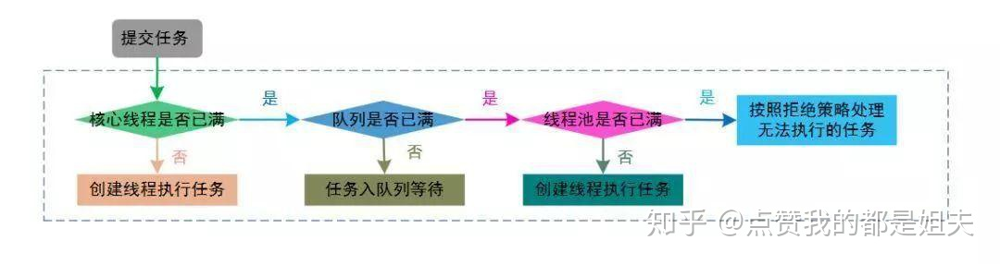

# 线程

## 什么是进程， 什么是线程

进程就是一个应用程序， 比如QQ，微信，IDEA, 浏览器。

线程是进程中的一个执行单元，一个进程执行过程中会开辟出多个线程。线程也称为轻量级进程

## 线程的优缺点

### 优点

利用计算机多CPU多核同时处理多件事（1个CPU同时只能执行一件事），合理的利用线程可以提升性能

### 缺点

线程使用不当会降低性能（PS： 线程与线程之前的切换需要耗费时间，所以如果线程过多不一定快）

多个线程对共享资源访问时，需要考虑线程安全的问题

## 守护线程与非守护线程

- 守护线程是为非守护线程服务。 必须线程执行之前调用Thread.setDaemon(true);可以设置为守护线程
- jvm虚拟机会等待非守护线程，但是不会等待守护线程

比如： java应用启动时最少会开辟两个线程，一个是main线程，一个是垃圾回收线程。垃圾回收线程是为main线程服务的。当main线程执行完毕不再生成垃圾时，垃圾回收线程也就没有了存在的必要。

main线程就是用户（守护）线程， 垃圾回收线程就是非守护线程

## 线程的上下文切换

多线程会共同使用一组计算机上的 CPU ，而线程数大于给程序分配的 CPU 数量时，为了让各个线程都有执行的机会，就需要轮转使用 CPU 。 不同线程之前的切换就是上下文切换


比如计算机只有1个CPU， 但是可以开辟多个进程以及多个线程（QQ, 微信，浏览器）。我们看到的情况是多个进程同时在执行，其实同时只能有一个进程线程在执行。 是因为多个线程会抢夺CPU的时间片，获取到时间片就执行，时间片执行完毕后其他线程会再次抢夺CPU的时间片就是上下文切换


## 线程调度算法

- **抢占式调度模型（默认）**。 多个线程抢夺CPU的时间片，抢夺到就执行，否则等待
- 分时调度模型。 CPU为每个线程分配平均的时间片，执行完毕后执行下一个线程

## 线程饥饿

一个或者多个线程因为种种原因无法获得所需要的资源，导致一直无法执行的状态

- CPU的时间片永远被高优先级的线程抢夺到，低优先级的线程无法执行到
- 线程在同步代码块（synchronized）外永远处于等待状态，没有机会执行

## **线程优先级的理解**

 每一个线程都有一个优先级，共1（最小）-10（最大）个优先级值,默认的优先级为5

理论上来说高优先级的线程会优于低优先级的线程执行。但是要依赖于操作系统，不一定是这样的，有可能低优先级的比高优先级的先执行。   

## 线程的生命周期

- 新建 :   当new一个线程对象，该线程就进入了新建状态
- 就绪：当调用了线程的start方法， 该线程就进入了就绪状态
- 运行： 当获取到CPU分配的时间片， 该线程就进入了运行状态
- 阻塞：由于某些原因导致正在执行的线程让出CPU的执行权
  - sleep(5000) : 睡眠5秒
  - wait():           等待
- 死亡：  当线程代码体（run方法）执行完毕，或者执行过程中出现异常


## 创建线程的三种方式

- 继承Thread类（继承了Thread类无法继承其他的类）
- 实现Runnable接口
- 实现Callable接口

## 什么叫线程安全

指某个函数、函数库在多线程环境中被调用时，能够正确地处理多个线程之间的共享变量，使程序功能正确完成。

servlet,springmvc(如果是单例的作用域）不是线程安全的

struts2，springmvc（如果是多例的作用域）是线程安全的


## 单例设计模式

某个类的实例在多线程环境下只会被创建一次出来

- 懒汉式单例
- 饿汉式单例
- 枚举

## Java Timer 类

`java.util.Timer` ，是一个工具类，可以用于安排一个线程在未来的某个特定时间执行。Timer 类可以用安排一次性任务或者周期任务。

`java.util.TimerTask` ，是一个实现了 Runnable 接口的抽象类，我们需要去继承这个类来创建我们自己的定时任务并使用 Timer 去安排它的执行。

```java
public static void main(String[] args) {
        Timer timer = new Timer();
        OrderTimer orderTimer = new OrderTimer();
    	// 1秒钟后执行， 每2秒钟执行一次， OrderTimer这个类中的run方法
        timer.schedule(orderTimer, 1000L, 2000L);
    }

    static class OrderTimer extends TimerTask {

        @Override
        public void run() {
            System.out.println("order timer");
        }
    }
```


### 缺点

- 如果执行定时任务的过程中出现了异常则定时任务就结束了，后续的定时任务也不会再触发
- 集群场景中所有的服务器都会执行该定时任务
- 无法处理复杂的定时场景

## Java 锁

- synchronized	

  ```
  jvm层面实现的锁, 用户不需要显示的释放锁，非常方便。
  只有获取到锁才能进入synchronized代码块， 否则只能等待在外边或者等锁释放继续竞争
  ```

- Lock

  ```
  jdk提供的锁，需要用户显示的获取释放锁
  ```

  

## 悲观锁和乐观锁

**悲观锁**，总是假设最坏的情况，每次去拿数据的时候都认为别人会修改，所以每次在拿数据的时候都会上锁，这样别人想拿这个数据就会阻塞直到它拿到锁。

java中synchronized或者lock

**乐观锁**，顾名思义，就是很乐观，每次去拿数据的时候都认为别人不会修改，所以不会上锁，但是在更新的时候会判断一下在此期间别人有没有去更新这个数据，可以使用版本号等机制。乐观锁适用于多读的应用类型，这样可以提高吞吐量。

java.util包下提供了一个Atomic开头的并发类，AtomicInteger,AtomicLong,AtomicReference等

## Java 线程池

我们可以通过Executors 的静态方法来创建线程池。

- `newFixedThreadPool(int nThreads)` ， 创建一个固定长度的线程池

- newCachedThreadPool（），创建一个可缓存的线程池

- newSingleThreadExecutor（），创建一个单线程的线程池。

- newScheduledThreadPool（int corePoolSize）创建了一个固定长度的线程池，而且以延迟或定时的方式来执行任务，类似 Timer 

  ```java
  package com.ule.payment.intranet.controller;
  
  import java.util.concurrent.ExecutorService;
  import java.util.concurrent.Executors;
  import java.util.concurrent.ScheduledExecutorService;
  
  public class Test {
  
      public static void main(String[] args) {
  
          // 创建一个包含了100个线程的线程池
          ExecutorService pool = Executors.newFixedThreadPool(100);
  
          // 创建一个可缓存的线程池
          ExecutorService pool1 = Executors.newCachedThreadPool();
  
          // 创建一个线程的线程池
          ExecutorService pool2 = Executors.newSingleThreadExecutor();
  
          // 创建一个核心线程数为10的线程池，而且可以延迟或者定时执行
          ScheduledExecutorService pool3 = Executors.newScheduledThreadPool(10);
  
      }
  }
  
  ```

  

## **如何使用 ThreadPoolExecutor 创建线程池**

Executors 提供了创建线程池的常用模板，实际场景下，我们可能需要自动以更灵活的线程池，此时就需要使用 ThreadPoolExecutor 类。

- corePoolSize, 核心线程数， 当线程数<corePoolSize（最大线程数）. 创建新的线程执行
- maxinumPoolSize， 最大线程数，当线程数>=corePoolSize，将新的任务放置到workQueue队列
- keepAliveTime， 当线程数大于 `corePoolSize` 的空闲线程能保持的最大时间。
- unit  时间单位。
- workQueue   保存任务的阻塞队列
- handler    超过阻塞队列的大小时，使用的拒绝策略
- threadFactory   创建线程的工厂

## **ThreadPoolExecutor 有哪些拒绝策略**

- 直接抛出异常 RejectedExecutionException 。
- 直接调用 run 方法并且阻塞执行。
- 直接丢弃后来的任务。
- 丢弃在队列中队首的任务。

## **线程池中 submit 和 execute 方法有什么区别**

两个方法都可以让线程池中的线程执行任务

- `#execute(...)` 方法，返回类型是 `void` ，它定义在 Executor 接口中。
- `#submit(...)` 方法，可以返回持有计算结果的 Future 对象, 可以通过返回的Future对象获取线程的执行结果

```java
package com.ule.payment.intranet.controller;

import java.util.concurrent.*;

public class Test {

    public static void main(String[] args) throws ExecutionException, InterruptedException {

        // 创建一个包含了100个线程的线程池
        ExecutorService pool = Executors.newFixedThreadPool(100);

        // 无法知道线程任务的执行结果
//        pool.execute(new OrderTask());

        Future future = pool.submit(new OrderTask2());
        // 通过future的get方法可以获取到线程任务的执行结果
        System.out.println(future.get());

        // 创建一个可缓存的线程池
        ExecutorService pool1 = Executors.newCachedThreadPool();

        // 创建一个线程的线程池
        ExecutorService pool2 = Executors.newSingleThreadExecutor();

        // 创建一个核心线程数为10的线程池，而且可以延迟或者定时执行
        ScheduledExecutorService pool3 = Executors.newScheduledThreadPool(10);

    }

    public static class OrderTask implements Runnable {

        @Override
        public void run() {
            System.out.println("orderTask runnable....");
        }
    }

    public static class OrderTask2 implements Callable {

        @Override
        public Object call() throws Exception {

            return "orderTask callable...";
        }
    }

}

```

## 线程池的执行流程

