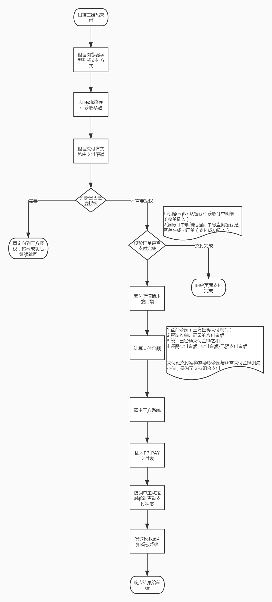

# 支付系统核心能力服务

##  扫码支付

### 应用场景

**展示支付二维码, 用户扫描二维码进行支付**

### 详细设计

1. 根据浏览器类型判断用户支付方式
2. 从缓存中获取参数**（生成二维码时插入缓存，有效期5分钟）**
3. 根据支付方式路由支付渠道（PS: 同一种支付方式可能存在多种支付渠道， 渠道费率不同）
4. 校验是否需要三方授权
   1. 如果需要三方授权，则重定向到三方授权
5. 验证订单是否重复支付
   1. 根据请求流水号从缓存获取订单明细列表**（收单时会插入redis）**
   2. 遍历订单列表， 根据订单号查询redis缓存中支付成功记录**（支付成功后插入缓存）**，若存在提示用户该笔订单已支付完成
6. 渠道支付请求数缓存自增1**（目的是为了渠道健康检查，支付成功数/支付请求数。 支付成功数在支付成功时会插入缓存）**
7. 计算还需支付金额
   1. 查询余额（PS:只有资产类支付渠道才能查询余额）
   2. 查询收单时记录的应付金额
   3. 查询已经预支付的金额总和
   4. 还需支付金额 = 应付金额-已预支付金额
8. 请求三方渠道统一下单（这步也可以理解为支付）
9. 插入支付表PP_PAY
10. 进行防调单监控处理
11. 发送支付消息到kafka. 由看板系统监听
12. 将响应结果响应给前端， 前端JS拉起第三方收银台

### 流程图

## 防调单处理

### 应用场景

**主动查询三方支付退款结果**

### 详细设计

1. 判断该网关是否需要防调单
   1. 从缓存中获取不需要防调单的网关列表**（手动配置插入到redis缓存）**， 如果包含当前网关直接结束
2. 处理防调单处理频率
   1. 从缓存中获取**（手动配置插入到redis缓存）**
      1. 若缓存存在， 则以缓存中频率间隔为准， 否则以本地为准（默认为90s, 10s, 30s, 60s）
3. 创建延迟任务线程池异步处理防调单
4. 根据reqNo请求流水号查询通知消息缓存中是否存在（支付订单系统及勾兑系统时插入缓存中）， 如果存在的话说明已经成功，无需再防调单结束
5. 调用三方系统查询支付状态
6. 如果支付失败， 则继续下一次间隔时间轮训调用三方系统查询支付状态（继续防调单处理），直至执行次数>=间隔时间个数时结束不再继续轮训。
7. 更新支付状态， 及做了预支付的流水做完支付**（同处理异步通知结果）**

## 三方异步结果通知

### 应用场景

**三方系统将支付退款结果通知支付系统**

### 详细设计

1. 接受三方响应的参数， 转为java对象（PS: 微信响应格式为xml格式）
2. 验签，保证数据的传输正确性
3. 从响应报文中获取交易状态
4. 将结果响应给三方， 响应给三方后就不会继续通知我们。
5. 如果交易状态为成功，则**（处理异步通知结果）**

## 处理异步通知

### 应用场景

三方通知支付退款结果，如果交易状态为成功，需要更新本地支付记录及处理完做了预支付的流水

### 详细设计

1. 根据payId查询PP_PAY支付表
2. 如果交易状态为支付完成则不再处理**（比如防调单处理查询成功后已经将状态修改或者三方多次通知）**
3. 根据三方通知的交易状态更新本地PP_PAY记录
4. 根据reqNo查询该请求已经做了预支付的流水列表（根据reqNo，新建状态，预支付渠道，支付类型查询PP_PAY表）
   1. 如果该流水支付状态已经为支付完成则跳过**（比如防调单处理查询成功后已经将状态修改或者三方多次通知）**
   2. 请求三方为该笔流水支付。
   3. 根据响应结果更新本地PP_PAY流水。
   4. 累计共支付的金额**（PS: 如果在支付过程中出现异常需要跳过该笔）**
5. 校验是否超额支付（PS: 例如用户应支付5元， 用户微信支付5元，此时三方结果未收到。用户再次支付5元收到通知造成超额支付，超额支付需将超额的金额返还用户）
   1. 根据reqNo查询PP_PAY_REQUEST(收单请求表)状态。
   2. 如果该状态为撤销，则修改PP_PAY记录为订单已取消， 如果状态为支付已完成， 则修改PP_PAY记录为超额支付
6. **如果是超额支付则调用系统退款服务**
7. 如果非超额退款
   1. 修改PP_PAY_REQUEST表已支付金额及状态。如果应付金额大于已支付金额则修改状态为**部分支付(PS:为预支付流水做支付时发生异常跳过该笔预支付流水就不会累计其金额)**， 否则修改状态为**支付完成**
   2. 更新PP_PAY_TRANS表记录为已完成
   3. 如果PP_PAY记录更新为支付完成的话
      1. 发送KAFKA通知订单系统支付完成
      2. 缓存用户本次支付使用的支付方式
      3. 将该笔订单对应的订单编号列表插入到redis中，供防重复使用
      4. 发送KAFKA通知勾兑系统

## cs后台系统退款

### 应用场景

**后台管理系统触发系统退款**

### 详细设计

1.  参数验证
   1. 非法验证
   2. 重复性验证， 根据条件查询PP_SYS_PAY_REFUND_DETAIL是否存在
2. 查询PP_PAY表原支付流水记录（原支付状态一定要是支付成功，否则不允许退款）
3. 插入支付系统退款表（PP_SYS_PAY_REFUND）
4. 插入支付系统退款明细表（PP_SYS_PAY_REFUND_DETAIL），主要存原支付流水信息
5. 插入支付表（PP_PAY）,该流水为退款流水
6. 以上三张表状态均为新建状态
7. 响应结果处理成功**（PS: 注意此时并没有退款给用户）**

## 定时系统退款

### 应用场景

每小时定时执行三次（每二十分钟一次）批量处理系统退款。 触发时间为每小时的2分，22分，42分

### 详细设计

1. 校验当前时间， 23：00～次日06:00之间不执行系统退款
2. 扫描系统退款表（PP_SYS_PAY_REFUND）状态为新建的系统退款流水
3. 遍历系统退款流水集合
   1. 根据退款refundId查询系统退款明细表（PP_SYS_PAY_REFUND_DETAIL）,组装退款参数
   2. 更新系统退款明细表（PP_SYS_PAY_REFUND_DETAIL）状态为处理中
   3. 更新退款流水（PP_PAY）状态为处理中
   4. 调用单笔退款
   5. 根据退款状态更新系统退款明细表（PP_SYS_PAY_REFUND_DETAIL）,退款流水（PP_PAY）
   6. 根据退款状态更新系统退款表（PP_SYS_PAY_REFUND）
      1. 新建，处理中更新为PP_SYS_PAY_REFUND状态为处理中
      
      2. 失败，退款异常更新PP_SYS_PAY_REFUND状态为失败

3. 否则更新PP_SYS_PAY_REFUND状态为成功
   
   ​      
   
   ​      

